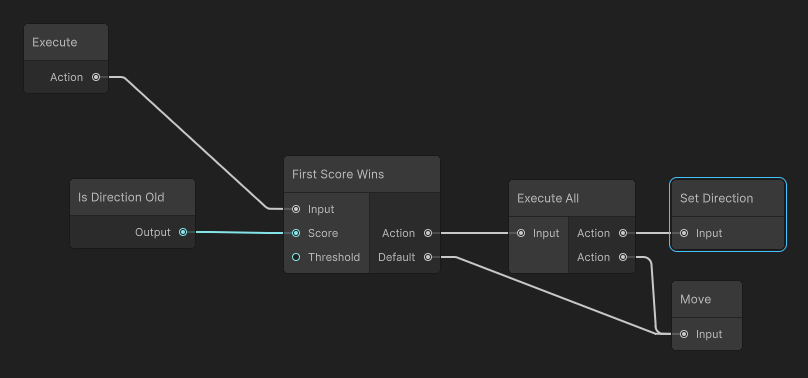
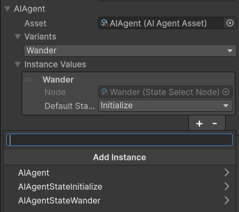
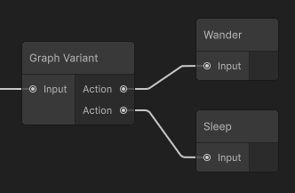
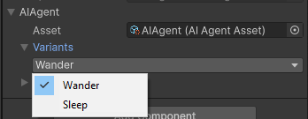

# BovineLabs Grove

BovineLabs Grove is a node-based graph system for Unity's Entity Component System (ECS). It's designed for creating behavior trees, dialogue systems, quest logic, visual scripting, and more - all within the DOTS ecosystem.

Access and updates are provided on [Buy Me a Coffee](https://buymeacoffee.com/bovinelabs) and support on [Discord](https://discord.gg/RTsw6Cxvw3).

## Installation

Grove is distributed as a zip file containing the package and its dependencies. To install:

1. Extract the zip to your Unity project's `Packages` folder
2. Grove depends on BovineLabs Core, which should be included in the release or can be found [here](https://gitlab.com/tertle/com.bovinelabs.core).

## Sample Project

To help you get started quickly, Grove includes a complete sample project demonstrating the minimum viable setup for a working graph system.

### Accessing the Sample

1. Open the Unity Package Manager (Window > Package Manager)
2. Select `BovineLabs Grove` from the package list
3. Navigate to the `Samples` section
4. Click "Import" on the Grove Sample

### What's Included

The sample provides a complete working example with:

- **Assembly Definition Files** - Properly configured assembly definitions demonstrating the recommended separation between Systems, Data, and Authoring code
- **Context Implementation** - A minimal working context with essential components
- **Custom Nodes** - Several example node implementations showing execution and data node patterns
- **Graph System** - A functioning runtime system that executes graphs
- **Editor Window** - A configured graph editor window
- **Authoring Components** - Components that handle the conversion from authoring to runtime
- **Example Scene** - A simple scene demonstrating the graph in action with an entity using instance values



### How to Use

By default, the sample will be imported to the `Samples/BovineLabs Grove/[VERSION]/Sample` directory.

Within the `Scenes` folder, load the scene called `SampleScene` and enter play mode.

You should see two entities moving back and forth every few seconds at different speeds, demonstrating how the graph can control entity behavior.

To view the above graph, double click `MyGraph` in the Data folder.

## Core Concepts

### Graphs

Graphs are collections of nodes connected through ports. Each graph is compiled into a blob asset for efficient runtime execution.

Key features:
- Blob storage
- Stateless
- Burst compatible
- Thread-safe execution
- Support for graph nesting and reuse
- Instance values
- Variant configurations

### Contexts

Contexts are the runtime data container for Grove graphs providing access to entity component data. They implement the `IContext<T>` interface and serve as the bridge between your ECS data and graph execution.

#### Defining a Context

To create a context:

1. Define a partial struct implementing `IContext<T>`, this should be placed in your Systems assembly.
2. Add containers for the components your nodes need to access
3. Optionally implement the `GetState` method
   1. This is only required if using `State` nodes
   2. Having a graph state offers benefits for storing local state without creating additional components
   3. Read the [Graph State](#graph-state) section for more details

```csharp
public partial struct MyContext : IContext<MyContext>
{
    [ReadOnly]
    public ComponentContainer<LocalTransform> LocalTransform;

    [ReadOnly]
    public ComponentContainer<CrowdAgent> CrowdAgents;

    public BufferContainer<GraphState> GraphStates;
    public ComponentContainer<CrowdAgentData> CrowdAgentDatas;
    public EnableableContainer<IsPathfinding> IsPathfindings;

    public NavMeshWorlds NavMeshWorlds;

    public BLDebug Debug;
    public Drawer Drawer;

    // This is optional and only required if using State nodes.
    public DynamicUntypedHashMap<short> GetState(int index)
    {
        return this.GraphStates.GetRW(index).AsMap();
    }
}
```

#### Source Generation
Grove uses source generation to eliminate boilerplate code in the `IContext` implementation. The source generator:

1. Automatically initializes and updates all container fields (ComponentContainer, BufferContainer, ComponentLookup, etc.)
2. Generates switch blocks and data conversions for all node implementations that reference your context type
3. Produces optional debugging logic when diagnostic features are enabled

#### Generated Code Example
For the `MyContext` example above, the source generator would produce code similar to this:

```csharp
public partial struct MyContext
{
    public void CreateGenerated(ref SystemState state)
    {
        this.LocalTransform = new global::BovineLabs.Grove.Utility.ComponentContainer<global::Unity.Transforms.LocalTransform>(ref state, true);
        this.CrowdAgents = new global::BovineLabs.Grove.Utility.ComponentContainer<global::BovineLabs.Movement.Data.CrowdAgent>(ref state, true);
        this.GraphStates = new global::BovineLabs.Grove.Utility.BufferContainer<global::Distort.AI.Data.Core.GraphState>(ref state, false);
        this.CrowdAgentDatas = new global::BovineLabs.Grove.Utility.ComponentContainer<global::BovineLabs.Movement.Data.CrowdAgentData>(ref state, false);
        this.IsPathfindings = new global::BovineLabs.Grove.Utility.EnableableContainer<global::BovineLabs.Movement.Data.IsPathfinding>(ref state, false);
    }

    public void SetChunkGenerated(in ArchetypeChunk chunk, int batchIndex)
    {
        this.LocalTransform.SetChunk(chunk);
        this.CrowdAgents.SetChunk(chunk);
        this.GraphStates.SetChunk(chunk);
        this.CrowdAgentDatas.SetChunk(chunk);
        this.IsPathfindings.SetChunk(chunk);
    }

    public void UpdateGenerated(ref SystemState state)
    {
        this.LocalTransform.Update(ref state);
        this.CrowdAgents.Update(ref state);
        this.GraphStates.Update(ref state);
        this.CrowdAgentDatas.Update(ref state);
        this.IsPathfindings.Update(ref state);
    }

    public TData DataGenerated<TData>(ref DataHeader header, in EntityContext entityContext, ref AIAgentContext context)
        where TData : unmanaged
    {
        return header.Type switch
        {
            (int)DataType.IsPathfinding => As(ScoreIsPathfinding.Calculate(ref Data<global::Distort.AI.Data.Nodes.Agent.Scorers.ScoreIsPathfindingData>(ref header), entityContext, ref context)),
            _ => default,
        };
        static unsafe TData As<TFrom>(TFrom from) where TFrom : unmanaged
        {
            return *(TData*)&from;
        }
        static unsafe ref TD Data<TD>(ref DataHeader header) where TD : unmanaged
        {
            return ref UnsafeUtility.AsRef<TD>((byte*)UnsafeUtility.AddressOf(ref header) + sizeof(DataHeader));
        }
    }

    public void ExecutionGenerated(ref ExecutionHeader header, in EntityContext entityContext, ref AIAgentContext context)
    {
        switch(header.Type)
        {
            case (int)ExecutionType.InitializeHome:
                ActionInitializeHome.Execute(entityContext, ref context);
                break;
            case (int)ExecutionType.MoveToRandomPoint:
                ActionMoveToRandomPoint.Execute(ref Data<global::Distort.AI.Data.Nodes.Agent.Actions.ActionMoveToRandomPointData>(ref header), entityContext, ref context);
                break;
        }
        static unsafe ref TD Data<TD>(ref ExecutionHeader header) where TD : unmanaged
        {
            return ref UnsafeUtility.AsRef<TD>((byte*)UnsafeUtility.AddressOf(ref header) + sizeof(ExecutionHeader));
        }
    }
    
    public float OptionGenerated<TOption>(ref OptionHeader header, in EntityContext entityContext, ref AIAgentContext context, ref TOption option)
        where TOption : unmanaged
    {
        return header.Type switch
        {
            (int)OptionType.GetBestHit => GetBestHit.Score(Data<global::Distort.AI.Nodes.Agent.Options.GetBestHitData>(ref header), entityContext, ref context, OptionUtility.As<TOption, HitData>(ref option)),
            _ => 0,
        };
        static unsafe ref TD Data<TD>(ref OptionHeader header) where TD : unmanaged
        {
            return ref UnsafeUtility.AsRef<TD>((byte*)UnsafeUtility.AddressOf(ref header) + sizeof(OptionHeader));
        }
    }

    // Additional generated methods for debug methods would be here
}
```

### Graph State

Graph State provides a way to store persistent data between graph executions without creating additional entity components.
This creates a clean separation between data that's meant for graph-internal logic and data that should be exposed to other systems.

#### What is Graph State?

Graph State is implemented using a `DynamicUntypedHashMap<short>` that allows you to store any unmanaged value type with a `short` key.
This hashmap persists between frames, allowing nodes to store and retrieve information as needed.

#### When to Use Graph State

Graph State is ideal for:

- Storing temporary data that your graph needs that other systems don't (countdown timers, cooldowns)
- Tracking internal graph state (current patrol point, time elapsed in state)
- Maintaining history (last attacked entity, previous positions)
- Implementing finite state machines

#### Using Graph State in Nodes

Here's a basic example of two nodes that use graph state to track the time spent in the current state:

```csharp
// Store the time the entity entered the current state
public static class StoreEntryTimeNode
{
    [ExecuteNode((int)ExecutionType.StoreEntryTime)]
    public static void Execute(in EntityContext entityContext, ref MyContext context)
    {
        var state = context.GetState(entityContext.EntityIndexInChunk);
        state.AddOrSet((short)GraphStateEnum.LastStateEnter, entityContext.ElapsedTime); // Store current time with key
    }
}

// Check if enough time has passed since entering the state
public static class TimeInStateNode
{
    [DataNode((int)DataType.TimeInState)]
    public static float Calculate(in EntityContext entityContext, ref MyContext context)
    {
        var state = context.GetState(entityContext.EntityIndexInChunk);
        
        if (state.TryGetValue((short)GraphStateEnum.LastStateEnter, out double entryTime))
        {
            return (float)(entityContext.ElapsedTime - entryTime);
        }
        
        // Alternatively a useful pattern is state.GetOrAddRef((short)GraphStateEnum.LastStateEnter, entityContext.ElapsedTime)
        return 0f;
    }
}
```

You should only use positive values for your custom keys, negatives are reserved for internal use.

### Nodes

Grove supports several node types and should be defined in your Systems assembly.

#### Scope

Nodes in Grove can be organized and filtered based on scope to maintain clean and focused graph editors:

Grove provides a filtering mechanism to ensure that only relevant nodes appear in specific graph types. This is particularly useful when working with multiple graph systems (like AI, dialogue, quests) in the same project.

Each node is tagged with a type filter attribute that determines where it can appear. Interfaces are the recommended way to implement this filtering as they provide clear inheritance hierarchies:

```csharp
public interface IDefaultNode : ICoreNode, IDefaultSelectorNode, IDefaultQualifierNode, IDefaultStateNode, IDefaultMathNode, IRequiredNode
```

When configuring your graph editor window, you specify which node types/interfaces should be included. This ensures that users only see relevant nodes when editing specific graph types. For example, AI behavior nodes won't appear when editing dialogue graphs.

The `IDefaultNode` interface includes all nodes from the Grove package, but you can define more specific interfaces to create targeted node collections for different graph types.

#### Execution Nodes

Execution nodes perform actions and control flow, summarized as `void Execute()`.

```csharp
// The serializable node definition which goes in your Authoring Assembly
[Node((int)ExecutionType.MoveUp, typeof(IMyNodes))]
public sealed class MoveUpNode : ExecutionNode
{
    public float Speed = 1;
    
    protected override BaseNodeElement CreateElement()
    {
        return new MoveUpNodeElement(this);
    }
}

// Node UI implementation and baking which also goes in your Authoring Assembly
public sealed class MoveUpNodeElement : ExecutionNodeElement<MoveUpData>
{
    private readonly MoveUpNode data;
    
    public MoveUpNodeElement(MoveUpNode data) : base(data)
    {
        this.data = data;
    }

    protected override void Init(ref BlobBuilder builder, ref MoveUpData execution, GraphBuildState state)
    {
        execution.Speed = this.data.Speed;
    }
}

// The nodes blob data which goes in your Data Assembly
public struct MoveUpData
{
    public float Speed;
}

// Runtime behavior which goes in your System Assembly
public static class MoveUp
{
    [ExecuteNode((int)ExecutionType.MoveUp)]
    public static void Execute(in MoveUpData data, in EntityContext entityContext, ref MyContext context)
    {
        ref var transform = ref context.Transforms.GetRW(entityContext.EntityIndexInChunk).ValueRW;
        transform.Position.y += data.Speed * entityContext.DeltaTime;
    }
}
```

#### Data Nodes

Data nodes calculate and return values, summarized as `T Calculate()`.

```csharp
// The serializable node definition which goes in your Authoring Assembly
[Node((int)DataType.Distance, typeof(IMyNodes))]
public sealed class DistanceNode : DataNode<float>
{
    protected override BaseNodeElement CreateElement()
    {
        return new DistanceNodeElement(this);
    }
}

// Node UI implementation and baking which also goes in your Authoring Assembly
public sealed class DistanceNodeElement : DataNodeElement<DistanceData, float>
{
    private GraphPort pointA;
    private GraphPort pointB;

    public DistanceNodeElement(DistanceNode data) : base(data) { }

    protected override void OnDefineNode()
    {
        base.OnDefineNode();
        this.pointA = this.AddInputDataPort<float3>("Point A", "PointA");
        this.pointB = this.AddInputDataPort<float3>("Point B", "PointB");
    }

    protected override void Init(ref BlobBuilder builder, ref DistanceData data, GraphBuildState state)
    {
        this.AllocateDataNode(ref builder, ref data.PointA, state, this.pointA);
        this.AllocateDataNode(ref builder, ref data.PointB, state, this.pointB);
    }
}

// The nodes blob data which goes in your Data Assembly
public struct DistanceData
{
    public BlobPtr<DataHeader<float3>> PointA;
    public BlobPtr<DataHeader<float3>> PointB;
}

// Runtime behavior which goes in your System Assembly
public static class Distance
{
    [DataNode((int)DataType.Distance)]
    public static float Calculate(ref DistanceData data, in EntityContext entityContext, ref MyContext context)
    {
        float pointA = data.PointA.Value.Calculate(in entityContext, ref context);
        float pointB = data.PointB.Value.Calculate(in entityContext, ref context);
        return math.distance(pointA, pointB);
    }
}
```

#### Option Scorer Nodes

Option scorer nodes evaluate and score each option for a set of custom data, summarized as `float Score(T[])`.

```csharp
// The serializable node definition which goes in your Authoring Assembly
[Node((int)OptionType.DistanceScore, typeof(IMyNodes))]
public sealed class DistanceScoreNode : OptionScorerNode
{
    public float MaxDistance = 10f;
    
    protected override BaseNodeElement CreateElement()
    {
        return new DistanceScoreNodeElement(this);
    }
}

// Node UI implementation and baking which also goes in your Authoring Assembly
public sealed class DistanceScoreNodeElement : OptionScorerNodeElement<TargetOption, float>
{
    private readonly DistanceScoreNode data;
    
    public DistanceScoreNodeElement(DistanceScoreNode data) : base(data)
    {
        this.data = data;
    }

    protected override void Init(ref BlobBuilder builder, ref DistanceScoreData option, GraphBuildState state)
    {
        option.MaxDistance = this.data.MaxDistance;
    }
}

// Option data structure
public struct TargetOption : IBufferElementData
{
    public Entity Target;
    public float3 Position;
}

// The nodes blob data which goes in your Data Assembly
public struct DistanceScoreData
{
    public float MaxDistance;
}

// Runtime behavior which goes in your System Assembly
public static class DistanceScore
{
    [OptionScorerNode((int)OptionType.DistanceScore, typeof(TargetOption))]
    public static float Score(in DistanceScoreData data, in EntityContext entityContext, 
        ref MyContext context, in TargetOption option)
    {
        var myPosition = context.Transforms.GetRO(entityContext.EntityIndexInChunk).ValueRO.Position;
        var distance = math.distance(myPosition, option.Position);
        
        // Lower distances give higher scores (inverted)
        return math.max(0, data.MaxDistance - distance);
    }
}

// Usage in an ExecutionOptions node
public sealed class SelectTargetNodeElement : ExecutionOptionsNodeElement<SelectTargetData, TargetOption>
{
    // Implementation...
    
    protected override void Init(ref BlobBuilder builder, ref SelectTargetData execution, GraphBuildState state)
    {
        // Connect to option scorers
        this.AllocateOptionScorers(ref builder, ref execution.Scorers, state);
        
        // Other initialization...
    }
}

// Using at runtime to find best option
public static class SelectTarget
{
    [ExecuteNode((int)ExecutionType.SelectTarget)]
    public static void Execute(ref SelectTargetData data, in EntityContext entityContext, ref MyContext context)
    {
        DynamicBuffer<TargetOption> options = context.TargetOptions.GetRO(entityContext.EntityIndexInChunk);
        
        // Find best option based on scorer results
        int bestIndex = data.Scorers.GetBest(entityContext, ref context, options.AsArray());
        
        if (bestIndex != -1)
        {
            // Use the selected option
            var selectedTarget = options[bestIndex].Target;
            // ...process the target...
        }
    }
}
```

### Graph Asset

Graph Assets are scriptable objects that store and serialize your node graphs. You should define Graph Asset classes in your Authoring assembly to keep them separate from your runtime code.

```csharp
[CreateAssetMenu(menuName = "BovineLabs/My Graph", fileName = "MyGraph")]
public class MyGraphAsset : GraphAsset
{
    // Optional: Override RequireInput property if your graph doesn't need an entry point
    // public override bool RequireInput => false;
}
```

Graph assets save node data, connections, positioning, and all serializable fields. They are converted to blob assets during baking.

### Instance Values

Instance Values allow you to override specific field values in a graph for individual entities, making it possible to reuse the same graph asset across multiple entities while customizing their behavior.

#### How Instance Values Work

When a graph is baked for an entity, instance values defined in the authoring component are applied to modify specific node properties and override the default values defined in the graph asset.

#### Setting Up Instance Values

1. Instance values automatically work on all unmanaged fields on nodes
2. Hitting the + button on the list will open a custom searchable dropdown with all available properties that can be overridden
3. If you don't know what to search for, you can click through the hierarchy:
   1. The first page will show you the list of graphs, including subgraphs
   2. Selecting a graph will then show you a list of nodes on that specific graph
   3. Selecting a node will then show you the list of properties that can be overridden
4. Once a property is selected, it'll appear in the list of Instance Values and can then have its value changed



### Variants

Variants allow you to define different execution paths within a graph that can be selected at baking time.
This enables flexible behavior customization while maintaining a single graph asset.

#### How Variants Work

A Variant node in the graph acts as a switch, directing execution to one of several possible paths.
The active path is determined by the variant value assigned to an entity during baking and the non-chosen paths are completely stripped out.



#### Setting Up Variants

1. Add a `GraphVariantNode` to your graph via Graph/Variant
2. Connect different execution paths to each output of the variant node
   1. You can add more variant options by right-clicking the node and selecting Add Port
3. You can set the default variant that the authoring component will use in the node inspector
4. In your authoring component, assign the desired variant value for each entity



### Editor Window

The Editor Window provides the visual interface for creating and editing your graphs:

To create a graph editor window for your specific graph type:

1. Define a class that inherits from `GraphEditorWindow<T, TContext, TAsset>`
2. Specify the valid node types that can appear in this editor
3. Implement the `OnOpenAsset` handler to automatically open your graphs when clicked

```csharp
public class MyGraphWindow : GraphEditorWindow<MyGraphWindow, MyContext, MyGraphAsset>
{
    // This defines the nodes that are valid on your graph
    // IDefaultNode includes the built-in nodes, IMyNodes includes nodes specific to this graph
    protected override Type[] ValidNodes { get; } = { typeof(IDefaultNode), typeof(IMyNodes) };

    // This ensures double-clicking your assets in the project window will open them in this editor
    [OnOpenAsset(1)]
    private static bool OpenGraphAsset(int instanceId, int line)
    {
        if (EditorUtility.InstanceIDToObject(instanceId) is not MyGraphAsset graphAsset)
        {
            return false;
        }

        ShowWindow(graphAsset);
        return true;
    }
}
```

## Entities Integration

### Component Data

Grove graphs can be attached to entities using both IComponentData and IBufferElementData:

To integrate Grove with your ECS architecture, you'll need to define components that implement the `IGraphReference` interface. This interface allows the baking system to properly connect your graph assets to entities.

```csharp
// Single graph component
public struct MyGraph : IComponentData, IGraphReference
{
    public BlobAssetReference<GraphData> Graph;

    unsafe ref BlobAssetReference<GraphData> IGraphReference.GraphRef
    {
        get
        {
            fixed (MyGraph* ptr = &this)
            {
                return ref ptr->Graph;
            }
        }
    }
}

// Multi-graph buffer component
[InternalBufferCapacity(0)]
public struct MyGraphBuffer : IBufferElementData, IGraphReference
{
    public BlobAssetReference<GraphData> Graph;

    unsafe ref BlobAssetReference<GraphData> IGraphReference.GraphRef
    {
        get
        {
            fixed (MyGraphBuffer* ptr = &this)
            {
                return ref ptr->Graph;
            }
        }
    }
}
```

The unsafe implementation of `GraphRef` provides direct access to the blob asset reference for baking. These components should be defined in your Data assembly to maintain proper separation of concerns. Note that for convenience, the `GraphRef` property on `IGraphReference` may be simplified in future releases.

### Authoring Components

Grove provides base classes for authoring components that handle the conversion of graph assets into ECS components:

- `GraphAuthoring<T, TA>` - For single-graph components (IComponentData)
- `GraphBufferAuthoring<T, TA>` - For multi-graph components (IBufferElementData)

These classes manage serialization of graph references, variants, and instance values.

```csharp
// Authoring for single graph components
public class MyGraphAuthoring : GraphAuthoring<MyGraph, MyGraphAsset>
{
    protected class Baker : Baker<MyGraphAuthoring>
    {
        public override void Bake(MyGraphAuthoring authoring)
        {
            base.Bake(authoring);
            
            // Add additional components if needed
            this.AddBuffer<GraphState>(this.GetEntity(TransformUsageFlags.None)).Initialize();
        }
    }
}

// Authoring for multi-graph buffer components
public class MyGraphBufferAuthoring : GraphBufferAuthoring<MyGraphBuffer, MyGraphAsset>
{
    protected class Baker : Baker<MyGraphBufferAuthoring>
    {
        public override void Bake(MyGraphBufferAuthoring authoring)
        {
            base.Bake(authoring);
            
            // Add additional components if needed
            this.AddBuffer<GraphState>(this.GetEntity(TransformUsageFlags.None)).Initialize();
        }
    }
}

// The baking system for your graphs
[WorldSystemFilter(WorldSystemFilterFlags.BakingSystem)]
public partial class MyGraphBakingSystem : GraphBakingSystem<MyGraph, MyGraphAsset>
{
    // A unique EditorPrefs key for this specific baker 
    protected override string VersionKey => "my_graph_baking_version";
}
```

Additionally, you need to implement a `GraphInstanceEditor` to properly display graph instance properties in the inspector:

```csharp
[CustomPropertyDrawer(typeof(GraphInstance<MyGraphAsset>))]
public class MyGraphInstanceEditor : GraphInstanceEditor<MyGraphAsset>
{
}
```

Finally, to ensure baking works correctly you must register a generic component in the `AssemblyInfo.cs`

```csharp
[assembly: RegisterGenericComponentType(typeof(GraphBakingData<MyGraphAsset>))]
```

### Runtime Execution

To execute graphs in your ECS system, you'll need to set up a system that processes all entities with graph components. The following example demonstrates how to efficiently execute graphs in parallel using the Burst compiler.

```csharp
public partial struct MyGraphSystem : ISystem, ISystemStartStop
{
    // The GraphImpl handles the initialization and management of your graph execution
    private GraphImpl<MyContext> graphImpl;

    [BurstCompile]
    public void OnStartRunning(ref SystemState state)
    {
        // Initialize the graph implementation in OnStartRunning allows access to subscene data if required
        // This will call MyContext.Create method
        this.graphImpl = new GraphImpl<MyContext>(ref state);
    }
    
    public void OnStopRunning(ref SystemState state)
    {
        // Optionally clean up any native containers etc you may have setup in MyContext
    }

    [BurstCompile]
    public void OnUpdate(ref SystemState state)
    {
        // Get the execution context for this frame
        var execution = this.graphImpl.GetExecution(ref state);
        
        // You can optionally setup any extra field data you want here, PhysicsWorld etc
        execution.Context.NavMeshWorlds = SystemAPI.GetSingleton<NavMeshWorlds>();
        execution.Context.Debug = SystemAPI.GetSingleton<BLDebug>();
        execution.Context.Drawer = SystemAPI.GetSingleton<DrawSystem.Singleton>().CreateDrawer<AIAgentSystem>();
        
        var query = SystemAPI.QueryBuilder().WithAll<MyGraph>().Build();
        
        state.Dependency = new ExecuteGraphJob
        {
            GraphExecution = execution,
            EntityHandle = SystemAPI.GetEntityTypeHandle(),
            MyGraphHandle = SystemAPI.GetComponentTypeHandle<MyGraph>(true),
        }.ScheduleParallel(query, state.Dependency);
    }
    
    [BurstCompile]
    private unsafe struct ExecuteGraphJob : IJobChunk
    {
        public GraphExecution<MyContext> GraphExecution;

        [ReadOnly]
        public EntityTypeHandle EntityHandle;

        [ReadOnly]
        public ComponentTypeHandle<MyGraph> MyGraphHandle;

        public void Execute(in ArchetypeChunk chunk, int unfilteredChunkIndex, bool useEnabledMask, in v128 chunkEnabledMask)
        {
            // Set the current chunk for the graph execution
            this.GraphExecution.SetChunk(chunk, unfilteredChunkIndex);

            var entities = chunk.GetEntityDataPtrRO(this.EntityHandle);
            var graphs = (MyGraph*)chunk.GetRequiredComponentDataPtrRO(ref this.MyGraphHandle);

            for (var entityIndex = 0; entityIndex < chunk.Count; entityIndex++)
            {
                this.GraphExecution.Execute(entities[entityIndex], entityIndex, graphs[entityIndex].Graph);
            }
        }
    }
    
    /* Alternative implementation for when using an IBufferElement instead of a component
    [BurstCompile]
    private unsafe struct ExecuteGraphJob : IJobChunk
    {
        public GraphExecution<MyContext> GraphExecution;

        [ReadOnly]
        public EntityTypeHandle EntityHandle;

        [ReadOnly]
        public BufferTypeHandle<MyGraphBuffer> MyGraphBufferHandle;

        public void Execute(in ArchetypeChunk chunk, int unfilteredChunkIndex, bool useEnabledMask, in v128 chunkEnabledMask)
        {
            this.GraphExecution.SetChunk(chunk, unfilteredChunkIndex);

            var entities = chunk.GetEntityDataPtrRO(this.EntityHandle);
            var graphs = chunk.GetBufferAccessor(ref this.MyGraphBufferHandle);

            for (var entityIndex = 0; entityIndex < chunk.Count; entityIndex++)
            {
                foreach(var graph in graphs[entityIndex])
                {            
                    this.GraphExecution.Execute(entities[entityIndex], entityIndex, graph.Graph);
                }
            }
        }
    }
    */
}
```

While `IJobChunk` is used in this example, you could alternatively use `IJobEntity` in combination with `IJobEntityChunkBeginEnd` and `[EntityIndexInQuery]`.
However, the `IJobChunk` approach is generally more straightforward for this use case.

### Debugging Nodes

Grove provides the ability to visualize node behavior and graph state during runtime. Debug nodes execute only in editor or development builds, making them perfect for validating behavior without affecting release performance.

#### Setting Up Debug Methods

To create a debug method for a node:

1. Add a method with the `ExecuteNodeDebug` or `DataNodeDebug` attribute
2. Optionally place the method inside `#if BL_DEBUG || UNITY_EDITOR` conditional compilation blocks to stop code reaching runtime
3. Optionally add a ConfigVar to toggle specific visualizations

```csharp
// Regular node execution method
[ExecuteNode((int)ExecutionType.MoveToRandomPoint)]
public static void Execute(ref ActionMoveToRandomPointData data, in EntityContext entityContext, ref AIAgentContext context)
{
    // Normal execution code...
}

#if BL_DEBUG || UNITY_EDITOR
// Debug visualization method
[ConfigVar("ai.wander-distance", false, "Debug the wander distance from home")]
private static readonly SharedStatic<bool> IsDebug = SharedStatic<bool>.GetOrCreate<bool, ActionMoveToRandomPointData>();

[ExecuteNodeDebug((int)ExecutionType.MoveToRandomPoint)]
public static void Debug(ref ActionMoveToRandomPointData data, in EntityContext entityContext, ref AIAgentContext context)
{
    if (!IsDebug.Data)
    {
        return;
    }

    var aiStates = context.GetState(entityContext.EntityIndexInChunk);
    if (Hint.Unlikely(!aiStates.TryGetValue((short)AIStateKey.Home, out float3 home)))
    {
        return;
    }

    // Using Quill to draw the wander distance around the creatures home position
    context.Drawer.Circle(home, math.up() * math.sqrt(data.Radius), Color.cyan);
}
#endif
```

#### Enabling Debug Visualization

To use debug visualizations:

1. Run in editor or in build with `BL_DEBUG` define
2. Enable global debugging with the `graph.debug-enabled` config var
3. Optionally in editor restrict debugging to only the selected entity in the hierarchy with `graph.debug-selected`
4. Toggle specific debug visualizations using their dedicated config vars (like `ai.wander-distance`)